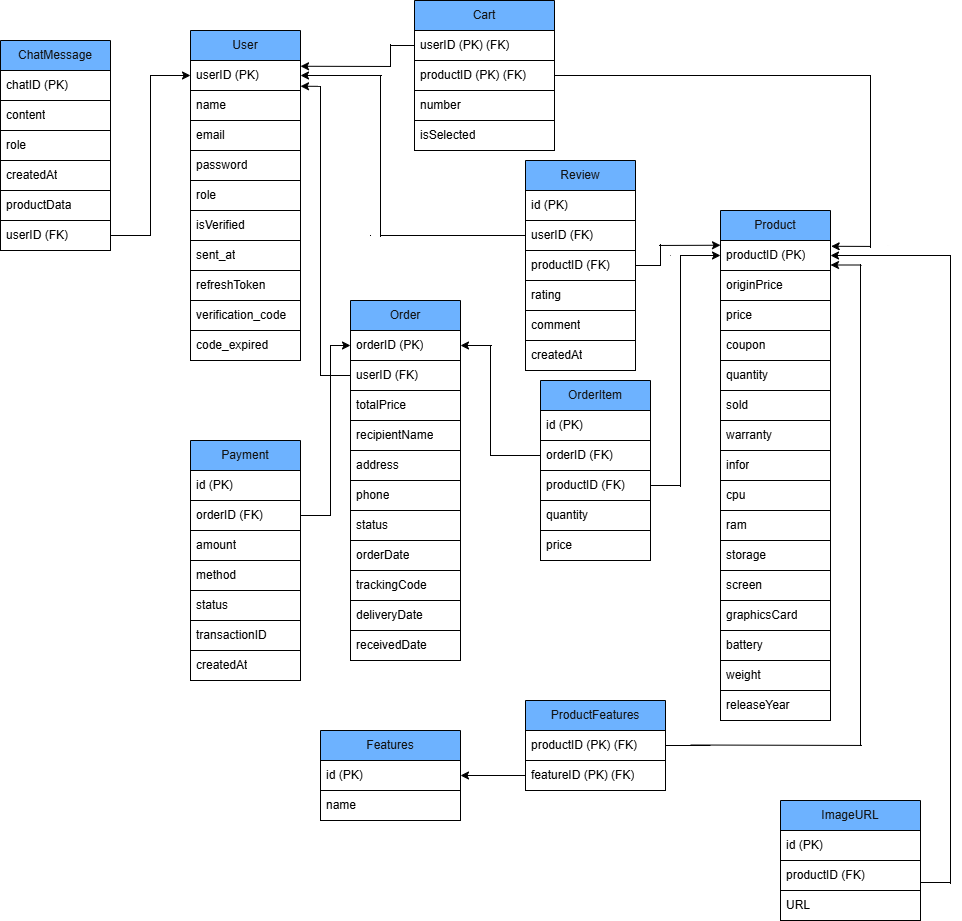

# 🛍️ TechZone – E-commerce System

A mini e-commerce platform for buying laptops, built with Spring Boot and React.

---

## 📘 Overview

**TechZone** is a backend-driven e-commerce system that provides:

- User registration, login, and email verification
- Profile management
- Product browsing and purchasing (in progress)
- Order and payment management (planned)

---

## 🔄 Migration from Node.js Version

Originally built with Node.js (Express):
https://github.com/dangngockhieu/Do_an1.git

This version was re-implemented using Spring Boot to achieve:

- Strong type safety
- Better structured architecture
- Improved scalability for larger systems

---

## 🚀 Development Journey & Migration

This project was developed in two main phases to experiment with and optimize the backend architecture:

- **Phase 1 (10/2025 – 12/2025):** Built the complete MVP (Minimum Viable Product) using **Node.js**. The focus was on rapid development and delivering core e-commerce functionalities.
- **Phase 2 (02/2026 – 03/2026):** Successfully migrated the entire backend system to **Spring Boot**.
  - **Why Migrate?** To apply strict Object-Oriented Programming (OOP) principles, enhance system scalability, and leverage the Spring ecosystem for better transaction management and security.
  - **Result:** The system is now restructured with a Layered Architecture, making the codebase more maintainable and optimizing query performance with PostgreSQL.

## 🧱 Tech Stack

| Layer    | Technology                   |
| -------- | ---------------------------- |
| Backend  | Spring Boot, Spring Data JPA |
| Security | Spring Security, JWT, Argon2 |
| Database | PostgreSQL                   |
| Mail     | Gmail SMTP                   |
| Frontend | React                        |

---

## 🏗️ Architecture

The backend follows a layered architecture:

- Controller: Handle HTTP requests
- Service: Business logic
- Repository: Data access layer

This structure improves maintainability and scalability.

---

## 🔄 Migration from Node.js Version

Originally built with Node.js (Express):
https://github.com/dangngockhieu/Do_an1.git

This version was re-implemented using Spring Boot to achieve:

- Strong type safety
- Better structured architecture
- Improved scalability for larger systems

---

### 🎨 Figma Design

🔗 [View Figma Design](https://www.figma.com/design/TrdxY3Fw1Iz9EdEhLgBJvc/Untitled?node-id=0-1&p=f&t=2A3bGnTvSRHaNvSl-0)

---

## 🔐 Key Features

- Authentication with JWT (Access + Refresh Token)
- Email verification & password reset
- Secure password hashing using Argon2
- HTTP-only Cookie for authentication
- Admin management (users & products)
- CRUD operations for core entities

---

## 🗄️ Database Design



This diagram shows the main entities and relationships of the TechZone backend.

---

## 🚀 Getting Started

### Clone Backend

```bash
git clone https://github.com/dangngockhieu/Laptopshop.git
```

### Clone Frontend

```bash
git clone https://github.com/dangngockhieu/Frontend-laptopshop.git
```

---

## ⚙️ Configuration

- Update database config in `application.yml`
- Configure Gmail App Password for email service

---

## 🧠 Dev Notes

- Passwords are securely hashed using Argon2
- JWT is used for authentication (access + refresh tokens)
- Authentication is handled via HTTP-only cookies
- Follows layered architecture for clean code organization
